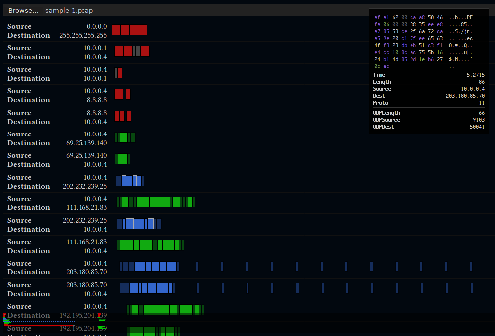

> **NOTE:** this code is all pretty old and pretty haphazardly written; it was
> really mostly designed to cover my needs for a reversing project at the
> time.  It's not very user-friendly, and I'd suggest using this project more
> as a reference rather than using it as is.

**Webshark** is a tool for visualizing pcap (e.g. Wireshark) network captures
on a timeline.  It was written as part of reverse-engineering efforts because
the tabular view in Wireshark didn't visualize the timing aspects of the
packets very well.

Webshark displays every pair of two IPs as a separate row; for this reason
you'll only want to load relatively small/well-filered packet captures into
Webshark.  I recommend setting up a network where only the devices you are
interested in are connected, and capturing that.

For now, Webshark supports only the classic pcap format (since it's so easy to
parse); captures in the newer pcapng format can be converted:

    $ editcap foo.pcapng foo.pcap

## Screenshot

## License
MIT license.
